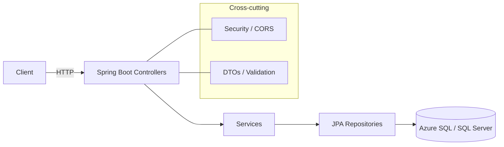

# 🏥 Campus Clinic - Medical Management System

<div align="center">


[](https://github.com/adryanmasson/campus-clinic-API/actions/workflows/ci.yml)

**Complete medical clinic management system with RESTful API, appointment scheduling, electronic medical records, and automated audit logging.**

[🌐 Live Demo](https://clinica-api-adryan.azurewebsites.net/api/specialties) | [📖 Documentation](#-api-endpoints) | [🚀 Deploy](#-azure-deployment)

> ⚠️ **Note:** Demo hosted on Azure App Service Free (F1) plan - may take 30-60 seconds to wake up on first request or be temporarily offline due to 60 min/day CPU quota. For local testing, see [Running Locally](#-running-locally).

</div>

---

## 📋 About the Project

Complete management system for medical clinics, developed with **Spring Boot** and **SQL Server**, providing full control over:

- 👨‍⚕️ **Doctors and Medical Specialties Management**
- 👤 **Patient Registration and Medical History**
- 📅 **Appointment Scheduling and Management**
- 📝 **Electronic Medical Records with Automatic Audit Trail**
- 🔍 **Advanced Queries and Reports**

### 🎯 Technical Highlights

- ✅ **RESTful Architecture** with standardized response patterns
- ✅ **Complete English Codebase** - all classes, methods, and endpoints in English
- ✅ **Native Stored Procedures & Functions** in SQL Server
- ✅ **Audit Triggers** for tracking medical record changes
- ✅ **Automated Deployment** via GitHub Actions to Azure App Service
- ✅ **Business Validations** at multiple layers (Database + Application)
- ✅ **Spring Security** configured with CORS for frontend integration

### 🌟 Reviewer Highlights
- **Fast to run**: one-command run via Docker.
- **Production-minded**: CI builds and tests on every push (GitHub Actions).
- **Pragmatic design**: clean layering (controllers → services → repositories) and DTOs.
- **Database-first**: stored procedures, functions, and triggers with audit.

---

## 🛠️ Technology Stack

### Backend
- **Java 17** - LTS with modern features
- **Spring Boot 3.4.5** - Main framework
- **Spring Data JPA** - Persistence and ORM
- **Spring Security** - Authentication and authorization
- **Maven** - Dependency management

### Database
- **Microsoft SQL Server** - Primary database
- **T-SQL** - Custom procedures, functions, and triggers
- **Azure SQL Database** - Cloud hosting

### DevOps & Cloud
- **Azure App Service** - Application hosting
- **GitHub Actions** - Automated CI/CD
- **Azure CLI** - Infrastructure management

---

## 🏗️ Architecture

```
┌─────────────────┐
│   Frontend      │
│  (Angular/React)│
└────────┬────────┘
         │ HTTPS
         ▼
┌─────────────────────────────────────────┐
│         Spring Boot REST API            │
├─────────────────────────────────────────┤
│  ┌──────────────┐  ┌─────────────────┐ │
│  │ Controllers  │  │  Security       │ │
│  │  (REST)      │  │  (CORS/Auth)    │ │
│  └──────┬───────┘  └─────────────────┘ │
│         │                                │
│  ┌──────▼───────────────────────────┐  │
│  │       Services Layer             │  │
│  │  (Business Logic & Validation)   │  │
│  └──────┬───────────────────────────┘  │
│         │                                │
│  ┌──────▼───────────────────────────┐  │
│  │    Repositories (JPA/Hibernate)  │  │
│  └──────┬───────────────────────────┘  │
└─────────┼───────────────────────────────┘
          │ JDBC
          ▼
┌─────────────────────────────────────────┐
│      SQL Server Database (Azure)        │
├─────────────────────────────────────────┤
│  • Tables: specialties, doctors,        │
│    patients, appointments,              │
│    medical_records, medical_record_audit│
│  • Functions: calculate_age             │
│  • Procedures: create_appointment       │
│  • Triggers: trg_medical_record_audit   │
└─────────────────────────────────────────┘
```

---

## 📚 API Endpoints

### Base URL
```
https://clinica-api-adryan.azurewebsites.net
```

All endpoints are prefixed with `/api` automatically via `spring.mvc.servlet.path=/api` configured in application.properties.

### 🩺 Medical Specialties

#### List All Specialties
```http
GET /api/specialties
```

**Response (200 OK)**
```json
{
  "status": "success",
  "message": "Specialties listed successfully.",
  "data": [
    {
      "specialtyId": 1,
      "name": "General Medicine",
      "description": "Treatment of common diseases and general health"
    }
  ]
}
```

#### Get Specialty by ID
```http
GET /api/specialties/{id}
```

#### Create New Specialty
```http
POST /api/specialties
Content-Type: application/json

{
  "name": "Cardiology",
  "description": "Treatment of heart and cardiovascular system"
}
```

#### Update Specialty
```http
PUT /api/specialties/{id}
Content-Type: application/json

{
  "name": "Clinical Cardiology",
  "description": "Updated description"
}
```

#### Delete Specialty
```http
DELETE /api/specialties/{id}
```

---

### 👨‍⚕️ Doctors

#### List All Doctors
```http
GET /api/doctors
```

**Response (200 OK)**
```json
{
  "status": "success",
  "message": "Doctors listed successfully.",
  "data": [
    {
      "doctorId": 1,
      "name": "Dr. James Anderson",
      "medicalLicense": "CRM123456",
      "specialty": {
        "specialtyId": 1,
        "name": "General Medicine"
      },
      "birthDate": "1975-04-20",
      "phone": "11912345678",
      "active": true
    }
  ]
}
```

#### Get Doctor by ID
```http
GET /api/doctors/{id}
```

#### Get Doctors by Specialty
```http
GET /api/doctors?specialty={specialty_id}
```

#### Register New Doctor
```http
POST /api/doctors
Content-Type: application/json

{
  "name": "Dr. James Anderson",
  "medicalLicense": "CRM123456",
  "specialty": {
    "specialtyId": 1
  },
  "birthDate": "1975-04-20",
  "phone": "11912345678"
}
```

#### Update Doctor
```http
PUT /api/doctors/{id}
Content-Type: application/json

{
  "name": "Dr. James Anderson Jr.",
  "phone": "11999999999"
}
```

#### Check Doctor Availability
```http
GET /api/doctors/{id}/availability?date={yyyy-MM-dd}
```

**Response**: Available time slots for appointments

---

### 👤 Patients

#### List All Patients
```http
GET /api/patients
```

**Response (200 OK)**
```json
{
  "status": "success",
  "message": "Patients listed successfully.",
  "data": [
    {
      "patientId": 1,
      "name": "John Smith",
      "gender": "M",
      "cpf": "12345678901",
      "birthDate": "1990-05-15",
      "phone": "11987654321",
      "address": "123 Main St",
      "email": "john.smith@email.com"
    }
  ]
}
```

#### Get Patient by ID
```http
GET /api/patients/{id}
```

#### Get Patient by CPF
```http
GET /api/patients/cpf/{cpf}
```

#### Register New Patient
```http
POST /api/patients
Content-Type: application/json

{
  "name": "John Smith",
  "gender": "M",
  "cpf": "12345678901",
  "birthDate": "1990-05-15",
  "phone": "11987654321",
  "address": "123 Main St",
  "email": "john.smith@email.com"
}
```

#### Update Patient
```http
PUT /api/patients/{id}
Content-Type: application/json

{
  "phone": "11999999999",
  "email": "new.email@email.com"
}
```

#### Get Patient History
```http
GET /api/patients/{id}/history
```

**Response**: Complete medical history with appointments and records

---

### 📅 Appointments

#### List All Appointments
```http
GET /api/appointments
```

**Response (200 OK)**
```json
{
  "status": "success",
  "message": "Appointments listed successfully.",
  "data": [
    {
      "id": 1,
      "patientName": "John Smith",
      "doctorName": "Dr. James Anderson",
      "appointmentDate": "2025-01-15",
      "startTime": "09:00:00",
      "endTime": "09:30:00",
      "status": "SCHEDULED"
    }
  ]
}
```

#### Get Appointments by Patient
```http
GET /api/appointments?patient={patient_id}
```

#### Get Appointments by Doctor
```http
GET /api/appointments?doctor={doctor_id}
```

#### Get Appointments by Date
```http
GET /api/appointments?date={yyyy-MM-dd}
```

#### Get Appointments by Status
```http
GET /api/appointments?status={SCHEDULED|COMPLETED|CANCELLED}
```

#### Schedule New Appointment
```http
POST /api/appointments/schedule
Content-Type: application/json

{
  "patientId": 1,
  "doctorId": 1,
  "appointmentDate": "2025-01-15",
  "startTime": "09:00:00",
  "endTime": "09:30:00"
}
```

#### Update Appointment
```http
PUT /api/appointments/{id}
Content-Type: application/json

{
  "appointmentDate": "2025-01-16",
  "startTime": "10:00:00"
}
```

#### Cancel Appointment
```http
DELETE /api/appointments/{id}
```

> **Note**: Cancellation changes status to CANCELLED and preserves record for audit

---

### 📝 Medical Records

#### List All Medical Records
```http
GET /api/medical-records
```

**Response (200 OK)**
```json
{
  "status": "success",
  "message": "Medical records returned successfully.",
  "data": [
    {
      "recordId": 1,
      "appointmentId": 1,
      "patientName": "John Smith",
      "doctorName": "Dr. James Anderson",
      "anamnesis": "Patient reports headache and fever for 2 days",
      "diagnosis": "Viral infection - Common cold",
      "prescription": "Rest, hydration, Paracetamol 500mg every 6 hours",
      "recordDate": "2024-12-10"
    }
  ]
}
```

#### Get Medical Record by ID
```http
GET /api/medical-records/{id}
```

#### Get Medical Record by Appointment
```http
GET /api/medical-records/appointment/{appointment_id}
```

#### Create New Medical Record
```http
POST /api/medical-records
Content-Type: application/json

{
  "appointmentId": 1,
  "anamnesis": "Patient reports...",
  "diagnosis": "Diagnostic hypothesis...",
  "prescription": "Prescribed medication..."
}
```

#### Update Medical Record
```http
PUT /api/medical-records/{id}
Content-Type: application/json

{
  "diagnosis": "Updated diagnosis",
  "prescription": "New prescription"
}
```

> **⚠️ Important**: All changes to medical records are automatically logged in the audit table through a database trigger.

---

## 🗄️ Data Model

### Main Tables

- **`specialties`** - Medical specialties (General Medicine, Cardiology, etc.)
- **`doctors`** - Doctor registry with medical license and specialty
- **`patients`** - Patient registry with personal and contact information
- **`appointments`** - Medical appointment bookings
- **`medical_records`** - Electronic medical records linked to appointments
- **`medical_record_audit`** - Medical record change history

### Functions and Procedures

#### Function: `dbo.calculate_age`
Calculates a person's age based on their date of birth.

```sql
SELECT dbo.calculate_age('1990-05-15') AS age
-- Returns: 35
```

#### Stored Procedure: `dbo.create_appointment`
Creates a new appointment with integrated business validations.

```sql
EXEC create_appointment 
  @p_patient_id = 1,
  @p_doctor_id = 1,
  @p_appointment_date = '2025-01-15',
  @p_start_time = '10:00',
  @p_end_time = '10:30'
```

#### Trigger: `trg_medical_record_audit_update`
Automatically logs all changes to medical records in the audit table.

---

## 🚀 Running Locally

### Prerequisites

- ☕ **Java 17** or higher
- 📦 **Maven 3.8+**
- 🗄️ **SQL Server 2019+** (or LocalDB/Docker)
- 🔧 **IDE** (IntelliJ IDEA, Eclipse, VS Code)

### Steps

1. **Clone the repository**
```bash
git clone https://github.com/adryanmasson/campus-clinic-api.git
cd campus-clinic-api
```

2. **Configure the database**

Create a SQL Server database:
```sql
CREATE DATABASE campus_clinic;
```

Execute the schema script:
```bash
sqlcmd -S localhost -d campus_clinic -i campus_clinic_schema.sql
```

(Optional) Populate with sample data:
```bash
sqlcmd -S localhost -d campus_clinic -i sample_data_english.sql
```

3. **Configure environment variables**

The application uses environment variables for database configuration. Set them in your system:

**Windows (PowerShell):**
```powershell
$env:SPRING_DATASOURCE_URL="jdbc:sqlserver://localhost:1433;database=campus_clinic;encrypt=false"
$env:SPRING_DATASOURCE_USERNAME="your_username"
$env:SPRING_DATASOURCE_PASSWORD="your_password"
```

**Linux/Mac:**
```bash
export SPRING_DATASOURCE_URL="jdbc:sqlserver://localhost:1433;database=campus_clinic;encrypt=false"
export SPRING_DATASOURCE_USERNAME="your_username"
export SPRING_DATASOURCE_PASSWORD="your_password"
```

**Alternative**: Edit `src/main/resources/application.properties` and replace `${...}` with actual values:
```properties
spring.datasource.url=jdbc:sqlserver://localhost:1433;database=campus_clinic;encrypt=false
spring.datasource.username=your_username
spring.datasource.password=your_password
```

4. **Build and run**
```bash
mvn clean package
java -jar target/clinica-0.0.1-SNAPSHOT.jar
```

Or run directly with Maven:
```bash
mvn spring-boot:run
```

5. **Access the API**
```
http://localhost:8080/api/specialties
```

---

## ☁️ Azure Deployment

This project is configured for automated deployment to **Azure App Service** via **GitHub Actions**.

### CI/CD Configuration

The workflow `.github/workflows/main_clinica-api-adryan.yml` automates:

1. ✅ **Build** the project with Maven
2. ✅ **Package** as executable JAR
3. ✅ **Deploy** to Azure App Service
4. ✅ **Health Check** verification

### Azure Environment Variables

Configure in Azure Portal (App Service → Configuration → Application settings):

```
SPRING_DATASOURCE_URL=jdbc:sqlserver://your-server.database.windows.net:1433;database=campus_clinic;encrypt=true;trustServerCertificate=false;hostNameInCertificate=*.database.windows.net;loginTimeout=30;
SPRING_DATASOURCE_USERNAME=your_username
SPRING_DATASOURCE_PASSWORD=your_password
```

### Azure Infrastructure

- **App Service**: Free F1 Plan - Brazil South
- **Azure SQL Database**: GeneralPurpose Gen5 - West US 2
- **Database Server**: campus-clinic-sql.database.windows.net

### Deployment Commands (Azure CLI)

```bash
# Login to Azure
az login

# Update database connection string
az webapp config appsettings set \
  --name clinica-api-adryan \
  --resource-group clinica-api-adryan_group \
  --settings SPRING_DATASOURCE_URL="jdbc:sqlserver://..."

# Restart app service
az webapp restart \
  --name clinica-api-adryan \
  --resource-group clinica-api-adryan_group
```

---

## 📁 Project Structure

```
campus-clinic-api/
├── src/
│   ├── main/
│   │   ├── java/com/example/clinica/
│   │   │   ├── controllers/          # REST endpoints
│   │   │   │   ├── SpecialtyController.java
│   │   │   │   ├── DoctorController.java
│   │   │   │   ├── PatientController.java
│   │   │   │   ├── AppointmentController.java
│   │   │   │   └── MedicalRecordController.java
│   │   │   ├── models/               # JPA entities
│   │   │   │   ├── Specialty.java
│   │   │   │   ├── Doctor.java
│   │   │   │   ├── Patient.java
│   │   │   │   ├── Appointment.java
│   │   │   │   ├── MedicalRecord.java
│   │   │   │   ├── AppointmentStatus.java
│   │   │   │   └── Gender.java
│   │   │   ├── repositories/         # Data access layer
│   │   │   ├── services/             # Business logic
│   │   │   ├── dto/                  # Data transfer objects
│   │   │   ├── exceptions/           # Exception handlers
│   │   │   ├── SecurityConfig.java   # Security configuration
│   │   │   └── WebConfig.java        # CORS configuration
│   │   └── resources/
│   │       └── application.properties
│   └── test/                         # Unit tests
├── campus_clinic_schema.sql          # Database schema
├── sample_data_english.sql           # Sample data
├── pom.xml                           # Maven dependencies
└── README.md                         # This file
```

## 🐳 Docker (Quick Start)

Build and run locally with Docker:

```bash
docker build -t campus-clinic-api .
docker run --rm -p 8080:8080 \
  -e SPRING_DATASOURCE_URL="jdbc:sqlserver://your-server.database.windows.net:1433;database=campus_clinic;encrypt=true;trustServerCertificate=false;hostNameInCertificate=*.database.windows.net;loginTimeout=30;" \
  -e SPRING_DATASOURCE_USERNAME="your_username" \
  -e SPRING_DATASOURCE_PASSWORD="your_password" \
  campus-clinic-api
```

If you don’t have a SQL Server handy, the API still starts but DB-backed endpoints will error — for interviews, this is enough to evaluate structure, security, and API design.

## 🧭 Architecture (Mermaid)



---

## 🤝 Contributing

Contributions are welcome! To contribute:

1. Fork the project
2. Create a feature branch (`git checkout -b feature/AmazingFeature`)
3. Commit your changes (`git commit -m 'Add some AmazingFeature'`)
4. Push to the branch (`git push origin feature/AmazingFeature`)
5. Open a Pull Request

---

## 📄 License

This project is licensed under the MIT License. See the [LICENSE](LICENSE) file for details.

---

## 👨‍💻 Author

**Adryan Masson**

- GitHub: [@adryanmasson](https://github.com/adryanmasson)
- LinkedIn: [Adryan Masson](https://linkedin.com/in/adryanmasson)
- Email: adryanpereiramasson@gmail.com

---

## 🙏 Acknowledgments

- Spring Boot Team for excellent documentation
- Microsoft Azure Community for support
- Course colleagues for collaboration and feedback

---

<div align="center">

**⭐ If this project was useful to you, consider giving it a star!**

Developed with ☕ and ❤️ by [Adryan Masson](https://github.com/adryanmasson)

</div>
